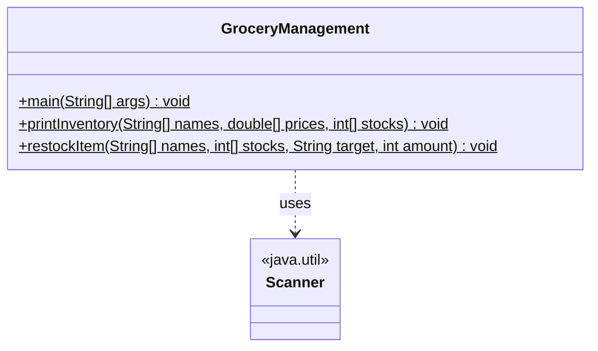
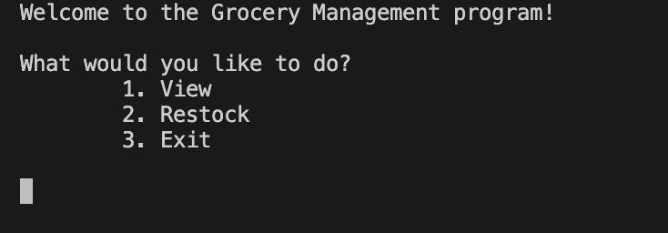
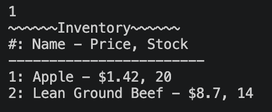
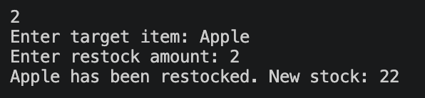
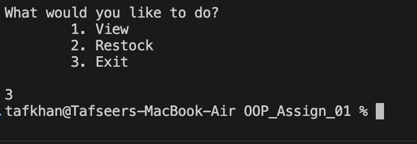

# OOP_Assign_01 - Grocery Management

## Group 15 Members  
### Eladio Gonzalez
- Implement Display Menu

### Myles Johnson 
- N/A

### Tafseer Khan 
- Setup up starter java file with organization, README

### Zach McCall 
- N/A

### Pujan Mijar 
- Implement Restock Feature

### Janisa Miles
- Implement Print Inventory

## UML Class Diagram


## Installation 
```bash 
javac GroceryManagement.java
java GroceryManagement
```

## Usage Screenshots 
### Main Menu


### Viewing Inventory


### Restocking an Item


### Exiting


## Usage Example 
[](https://asciinema.org/a/DddL7mKuFCQ8Non4)